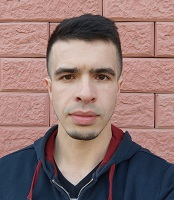
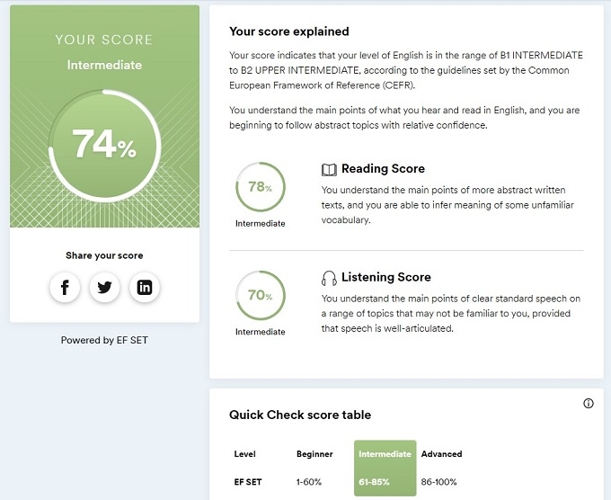

# Evgenii Zabolotskikh



## *Contacts*
* **Location:** Kostanay, Kazakhstan
* **Phone:** +7 747 371 6442, +7 747 656 3137
* **Email:** 3abolotskih@gmail.com
* **GitHub:** [Chferchko](https://github.com/Chferchko)
* **Telegram:** [Empty Full](https://t.me/full3mpty)

---
## *About Myself*
Hello, I am a beginner developer since 15 Nov 2022. Want to start my freedom life and help other people who want to save their personal time and get a responsible employee. Currently, I can make a simple landing page, but I will learn and improve my web development skills and hope to master them by becoming a full-stack developer.

---
## *Dev Skills*
* **HTML**
* **CSS**
	* Flex / Grid
	* Animation
	* Responsive page
* **SCSS**
* **JavaScript** (basic)
* **Git** / **GitHub**
* **VScode** / **Figma**

---
## *Code Example*
```
let text = 'Фрилансер';
let subtext = "н";
let position = 0;

let getEndPosition = () => position + subtext.length;
let getSubtextFromCurrentPosition = () => text.slice(position, getEndPosition());
let isThereSubtextInText = () => text.includes(subtext);

function showSubtextFromCurrentPosition() {
	console.log(getSubtextFromCurrentPosition());
};

function showSubtextWarningMessage() {
	console.log(`Текст не содержит - "${subtext}"`);
};

function showAllSubtextsInText() {
	for (const symbol of text) {
		if (getSubtextFromCurrentPosition() === subtext) showSubtextFromCurrentPosition();
		position++;
	}	
};

isThereSubtextInText() ? showAllSubtextsInText() : showSubtextWarningMessage();
```

---
## *Dev Experience*
Self-studying and a great beginner course of a secret Frontend Developer freelancer from youtube. Also have a good friend, a back-end developer, who is kind of a mentor to me.

---
## *Education*
* **Secondary Education:** [Magnitogorsk city multidisciplinary lyceum at MSTU](https://goo.gl/maps/1gtKp9iqZMeQPvwT6)
* **University:** [Nosov Magnitogorsk State Technical University](https://goo.gl/maps/JHA7d1VdPxAgBBkc7) / [Department of Materials Processing Technologies](https://www.magtu.ru/sveden/struct/instituty-fakultety-kafedry/institut-metallurgii-mashinostroeniya-i-materialoobrabotki/kafedry-instituta-mmim/napravlenie-metallurgiya/kafedra-tekhnologij-obrabotki-materialov.html)
* **Development:** a secret Frontend Developer freelancer from youtube :)

---
## *Eng language Skill*
**result of [quicktest](https://www.efset.org/quick-check/)
<br>

